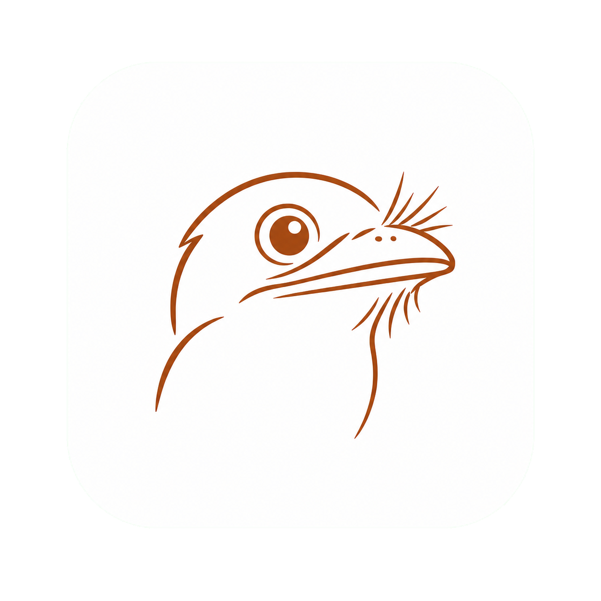

# frogmouth

<p align="center">
  
</p>

frogmouth is a macOS app for quickly stabilizing and trimming videos, then exporting a smaller, high-quality HEVC file.

The project was initially designed and developed with Canon EOS R5 footage in mind—primarily 4K H.264 MP4 files with AAC audio. Those videos remain its principal development and testing material, while the application UI is intentionally camera-agnostic. Other formats that FFmpeg can decode are supported on a best-effort basis unless documented otherwise.

The current implementation design is in [TECHNICAL_DESIGN.md](TECHNICAL_DESIGN.md). The proposed single-track editor is specified in [TIMELINE_DESIGN.md](TIMELINE_DESIGN.md), with an ordered execution backlog in [TIMELINE_IMPLEMENTATION_TASKS.md](TIMELINE_IMPLEMENTATION_TASKS.md). Stabilization latency, benchmarks, alternatives, and optimization decisions are tracked in [STABILIZATION_PERFORMANCE.md](STABILIZATION_PERFORMANCE.md).

The first timeline release will preserve the colour characteristics established by its first clip. Clips with conflicting primaries, transfer function (including HDR or Log), matrix, or full/limited range will be rejected with the differing properties listed; frogmouth will not silently convert them. Proper colour conversion is deferred to a later iteration.

## Development

Requirements:

- Apple-silicon Mac running macOS 15 or newer
- Xcode 26 / Swift 6
- The tested FFmpeg 7.1.1 build containing `vidstabdetect`, `vidstabtransform`, and `hevc_videotoolbox`

Open `Package.swift` in Xcode and run the `frogmouth` executable scheme, or use:

```sh
swift run frogmouth
```

Build a local, unsigned app bundle with:

```sh
./scripts/build-app.sh
```

The result is `build/frogmouth.app`. Run tests with `swift test`.

frogmouth verifies FFmpeg only at startup. When setup is required, install the documented build and restart the app.

## Future development ideas / to do

- H.264 compatibility export for recipients or older hardware/software that cannot reliably decode HEVC; it needs more bitrate for comparable quality.
- Implement the proposed gapless, single-track multi-clip timeline ([design](TIMELINE_DESIGN.md), [tasks](TIMELINE_IMPLEMENTATION_TASKS.md)).
- Basic colour controls: exposure, white balance, and contrast while preserving a no-adjustment default.
- A stabilization-strength slider after preset tuning is validated.
- Before/after comparison and finer trim controls.
- Expose and manage the currently implicit ordered edit-operation stack.
- Process stabilization as background per-clip jobs while editing continues.
- Recent Projects, comprehensive timeline keyboard controls, and user-configurable editor layout.
- A source preview with pre-insert in/out selection, audio waveforms, transitions, and selected-range export.
- Custom timeline canvas settings, proper SDR/HDR/Log conversion, and broader colour management.
- Folder-assisted missing-media search and an in-app Relink workflow.
- Broader, tested format-support tiers beyond Canon-style MP4.
- A maintained supported-FFmpeg list and smoother update guidance.
- Reconsider bundled FFmpeg only if convenience outweighs release size, licensing, update, and signing burden.
- Batch/CLI automation and a macOS sharing workflow.
- Add code signing and notarization before distributing frogmouth outside a local development build.
